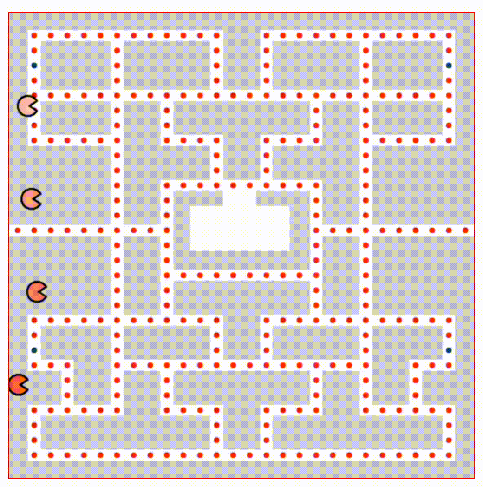

# Canvas

## Glossary

`clearRect`: The clearRect() method clears the specified pixels within a given rectangle (context.clearRect(x,y,width,height)).

`beginPath()`: begins a path, or resets the current path.

`The closePath()` method creates a path from the current point back to the starting point.

`The stroke()` method actually draws the path you have defined with all those moveTo() and lineTo() methods. The default color is black.

`The fill()` method fills the current drawing (path). The default color is black.

## References

- [API Canvas](https://developer.mozilla.org/es/docs/Web/API/Canvas_API)
- [Path2D](https://developer.mozilla.org/en-US/docs/Web/API/Path2D)
- [CanvasRenderingContext2D.arc()](https://developer.mozilla.org/en-US/docs/Web/API/CanvasRenderingContext2D/arc)
- [CanvasRenderingContext2D.lineTo()](https://developer.mozilla.org/en-US/docs/Web/API/CanvasRenderingContext2D/lineTo)
- [https://developer.mozilla.org/en-US/docs/Web/API/CanvasRenderingContext2D/moveTo](https://developer.mozilla.org/en-US/docs/Web/API/CanvasRenderingContext2D/moveTo)
- [CanvasRenderingContext2D.fillRect()](https://developer.mozilla.org/es/docs/Web/API/CanvasRenderingContext2D/fillRect)
- [HTML canvas lineTo() Method](https://www.w3schools.com/tags/canvas_lineto.asp)
- [CanvasRenderingContext2D.clearRect()](https://developer.mozilla.org/en-US/docs/Web/API/CanvasRenderingContext2D/clearRect)
- [Window.requestAnimationFrame()](https://developer.mozilla.org/es/docs/Web/API/Window/requestAnimationFrame)
